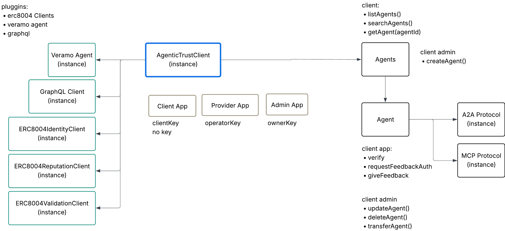

# Agentic Trust


**Foundation for agentic trust packages - Core SDK and applications**

A modern, extensible monorepo for building trustworthy autonomous agent systems.This project provides the infrastructure and primitives needed to create, manage, and trust AI agents.

## 🏗️ Architecture

This is a monorepo managed with [Turbo](https://turbo.build/) and [pnpm workspaces](https://pnpm.io/workspaces).




```
agentic-trust/
├── packages/
│   ├── core/              # Core SDK - AgenticTrustClient, singletons, A2A protocol
│   ├── erc8004-agentic-trust-sdk/  # ERC-8004 SDK integration
│   └── erc8004-sdk/       # ERC-8004 SDK adapters
├── apps/
│   ├── web/               # Next.js web client application
│   └── provider/          # Next.js agent provider application
├── turbo.json            # Turborepo configuration
└── package.json          # Workspace configuration
```

### Core Architecture Components

#### Singleton Pattern

The architecture uses a singleton pattern for managing client and provider state:

- **`ClientApp`** - Singleton for client-side operations
  - Provides typical client account, wallet client, and address
  - Used for client operations like leveraging agent A2A and MCP endpoings, and giving feedback

- **`ProviderApp`** - Singleton for provider-side operations
  - Provides agent provider account, delegation setup, and wallet client
  - Used for agent activities like reputation management

- **`AdminApp`** - Singleton for provider-side operations
  - Provides agent admin account and setup
  - Used for agent administration like setting up agent

#### AgenticTrustClient

The main client class provides:

- **`agents`** - Agent discovery and engagement via GraphQL API
- **`...`** - Agent-to-Agent protocol support

## 📦 Packages

### @agentic-trust/core

Core SDK providing:
- **AgenticTrustClient**: Main client for interacting with agents
- **Agent Discovery**: Query and list agents via GraphQL API
- **A2A Protocol**: Agent-to-Agent communication protocol support
- **Veramo Integration**: DID management and authentication
- **Reputation System**: ERC-8004 feedback and reputation management
- **Session Packages**: Smart account delegation via session packages

**Key Components:**
- `AgenticTrustClient` - Main client class
- `ClientApp` - Singleton for client operations (private key based)
- `ProviderApp` - Singleton for provider operations (session package based)
- `ReputationClient` - Singleton for reputation operations
- `Agent` - Agent instance with messaging and verification capabilities

[See full documentation →](./packages/core/README.md)

## 🚀 Getting Started

### Prerequisites

- Node.js >= 20.0.0
- pnpm >= 8.0.0

### Installation

```bash
# Clone the repository
cd agentic-trust

# Install dependencies
pnpm install

# Build all packages
pnpm build
```

### Development

```bash
# Run development mode with watch
pnpm dev

# Run tests
pnpm test

# Type check
pnpm type-check

# Lint
pnpm lint

# Format code
pnpm format
```

## 🔧 Using the Core SDK

```bash
# Install in your project
pnpm add @agentic-trust/core
```

### Basic Usage

```typescript
import { AgenticTrustClient } from '@agentic-trust/core';

// Create client
const client = await AgenticTrustClient.create({
  graphQLUrl: 'https://api.example.com',
  apiKey: 'your-api-key',
  privateKey: '0x...', // Optional: for Veramo agent
  rpcUrl: 'https://eth-sepolia.g.alchemy.com/v2/...', // Optional: for DID resolution
});

// List agents
const { agents } = await client.agents.listAgents();

// Get a specific agent
const agent = await client.agents.getAgent('943');

// Send a message to an agent
const response = await agent.sendMessage({
  message: 'Hello agent',
  skillId: 'agent.feedback.requestAuth',
});

// Verify an agent
const isValid = await agent.verify();

// Get client address
const address = await client.getClientAddress();
```

### Server-Side API Pattern (Next.js)

```typescript
// apps/web/src/lib/server-client.ts
import { AgenticTrustClient } from '@agentic-trust/core';

let serverClient: AgenticTrustClient | null = null;

export async function getServerClient(): Promise<AgenticTrustClient> {
  if (!serverClient) {
    serverClient = await AgenticTrustClient.create({
      graphQLUrl: process.env.AGENTIC_TRUST_GRAPHQL_URL!,
      apiKey: process.env.AGENTIC_TRUST_API_KEY,
      privateKey: process.env.AGENTIC_TRUST_PRIVATE_KEY,
      rpcUrl: process.env.AGENTIC_TRUST_RPC_URL,
    });
  }
  return serverClient;
}
```

### Environment Variables

**Client App (web):**
```bash
AGENTIC_TRUST_IS_CLIENT_APP=true
AGENTIC_TRUST_PRIVATE_KEY=0x...
AGENTIC_TRUST_RPC_URL=https://...
AGENTIC_TRUST_GRAPHQL_URL=https://...
AGENTIC_TRUST_API_KEY=...
AGENTIC_TRUST_IDENTITY_REGISTRY=0x...
AGENTIC_TRUST_REPUTATION_REGISTRY=0x...
```

**Provider App:**
```bash
AGENTIC_TRUST_IS_PROVIDER_APP=true
AGENTIC_TRUST_SESSION_PACKAGE_PATH=./sessionPackage.json.secret
AGENTIC_TRUST_IDENTITY_REGISTRY=0x...
AGENTIC_TRUST_REPUTATION_REGISTRY=0x...
AGENTIC_TRUST_ENS_REGISTRY=0x...
AGENTIC_TRUST_RPC_URL=https://...
```

## 🏛️ Project Structure

### Packages

The `packages/` directory contains reusable libraries and SDKs:

- **`core/`**: Core SDK with `AgenticTrustClient`, singletons, and A2A protocol
- **`erc8004-agentic-trust-sdk/`**: ERC-8004 SDK integration for reputation system
- **`erc8004-sdk/`**: ERC-8004 SDK adapters (Viem, Ethers)

### Apps

The `apps/` directory contains applications built on top of the core packages:

- **`web/`** - Next.js web client application
  - Client-side UI for discovering and interacting with agents
  - Server-side API routes for all blockchain operations
  - Uses `ClientApp` singleton for client operations

- **`provider/`** - Next.js agent provider application
  - A2A protocol endpoint (`/api/a2a`)
  - Agent card endpoint (`/.well-known/agent-card.json`)
  - Uses `ProviderApp` singleton for agent operations
  - Handles feedback authentication requests

Both apps follow the server-side architecture pattern where all sensitive operations happen in Next.js API routes.

## 🎯 Roadmap

- [x] Core SDK with AgenticTrustClient
- [x] Agent discovery via GraphQL API
- [x] A2A (Agent-to-Agent) protocol support
- [x] Veramo integration for DID management
- [x] ERC-8004 reputation system integration
- [x] Session package support for smart account delegation
- [x] Client and Provider application architectures
- [x] Singleton pattern for state management
- [ ] Advanced trust scoring algorithms
- [ ] Multi-agent orchestration
- [ ] Agent marketplace
- [ ] CLI tool for agent management

## 🔌 Extending the Platform

### Adding a New Package

```bash
# Create package directory
mkdir -p packages/my-package/src

# Create package.json
cat > packages/my-package/package.json << 'EOF'
{
  "name": "@agentic-trust/my-package",
  "version": "0.1.0",
  "type": "module",
  "main": "./dist/index.js",
  "types": "./dist/index.d.ts",
  "scripts": {
    "build": "tsc -b",
    "dev": "tsc -b --watch"
  },
  "dependencies": {
    "@agentic-trust/core": "workspace:*"
  }
}
EOF

# Create tsconfig.json
cat > packages/my-package/tsconfig.json << 'EOF'
{
  "extends": "../../tsconfig.json",
  "compilerOptions": {
    "outDir": "./dist",
    "rootDir": "./src"
  }
}
EOF
```

### Adding an App

```bash
# Create app directory
mkdir -p apps/my-app/src

# Follow similar structure as packages
```

## 🧪 Testing

```bash
# Run all tests
pnpm test

# Run tests in watch mode
pnpm test:watch

# Run tests for specific package
cd packages/core && pnpm test
```

## 📚 Documentation

- [Core SDK Documentation](./packages/core/README.md)
- API Reference (coming soon)
- Architecture Guide (coming soon)
- Plugin Development (coming soon)

## 🤝 Contributing

Contributions are welcome! Please read our contributing guidelines (coming soon).

1. Fork the repository
2. Create a feature branch
3. Make your changes
4. Add tests
5. Submit a pull request

## 📄 License

MIT License - see LICENSE file for details


## 🔗 Related Projects

- [ENS](https://ens.domains/) - Ethereum Name Service
- [ERC-8004](https://eips.ethereum.org/EIPS/eip-8004) - Non-Fungible Token Ownership Designation Standard

## 📧 Contact

For questions and support, please open an issue on GitHub.

